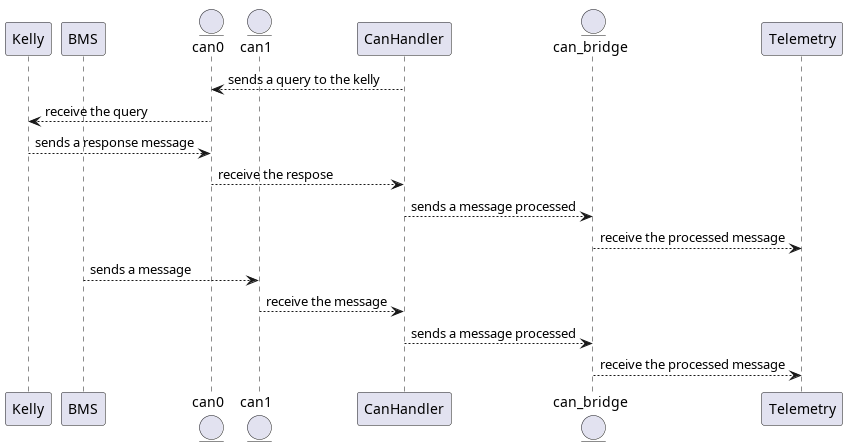
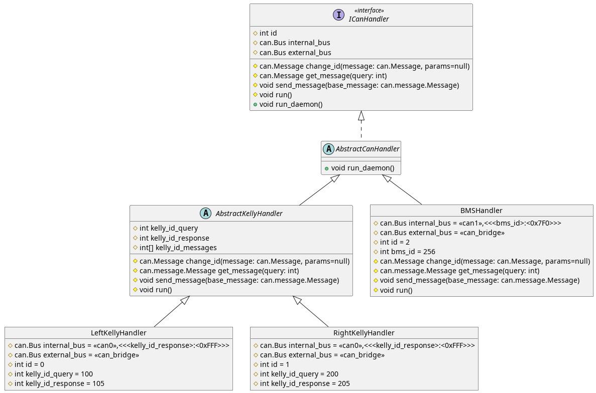

# Eolian Can Handler

This repo has the code for a code that covers all the physical can bus managing all the messages and sending a processed message version to a virtual can bus.

The telemetry of the car only reads the virtual can with the processed messages and never touches the real messages, thi is in order to abstract the responsability of handling heterogeneous behaviors.

The code whas called Can Handler for its responsability and the problems it solves.

## How it works

The basic behavior of the code could be look on the sequence diagram below:



A breve summary of the behavior:
* The can handler listen the physical can bus.
* The can handler retrieve a message from the physical bus.
* The can handler modifies the message to solve any issue with the information inside.
* The can handler sends the new message to the virtual can.

## Desing

For the desing where used the asyncio library to use only 1 thread but mantaining a n number of handlers working on the most efficient way possible with lack of threads and the handlers where made it with a singleton pattern in order to avoid duplicity.

For more visual inspaction you can find below the class diagram of the actual code.



## To add a new handler

To add a new handler you will have to create the classes and follow the interfaces/abstract classes, but also you will need to add the new handler on the can_handler_runner file to ensure that the handler is going to be executed.

## How to run

To run the code you have to run the can_handler_runner as below.

```Batchfile
python can_handler_runner.py
```
